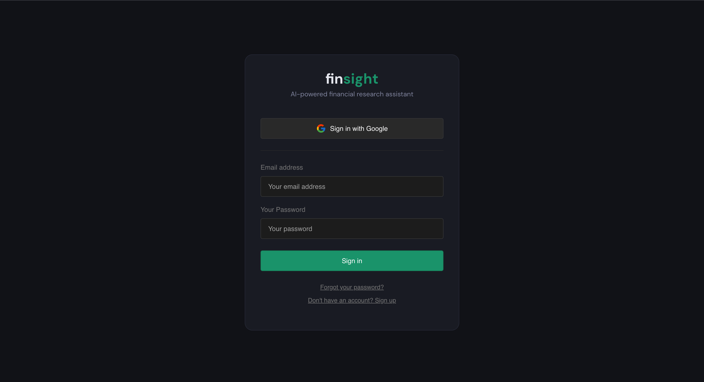
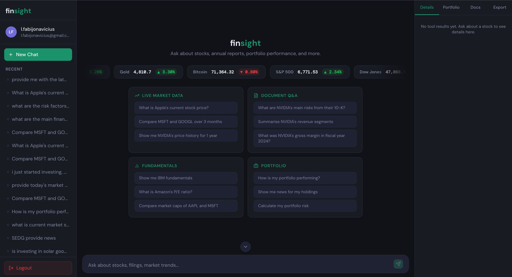
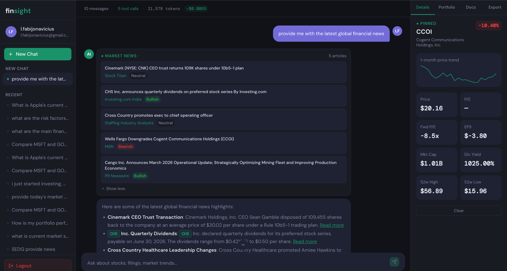
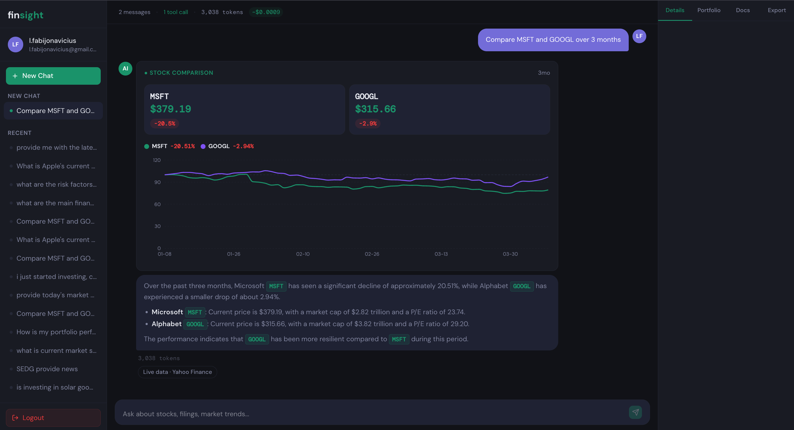
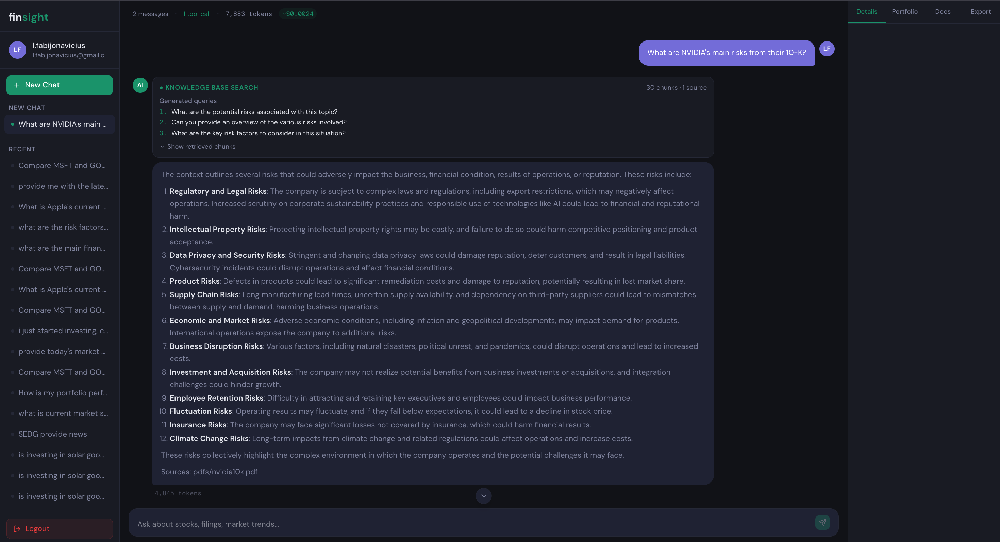
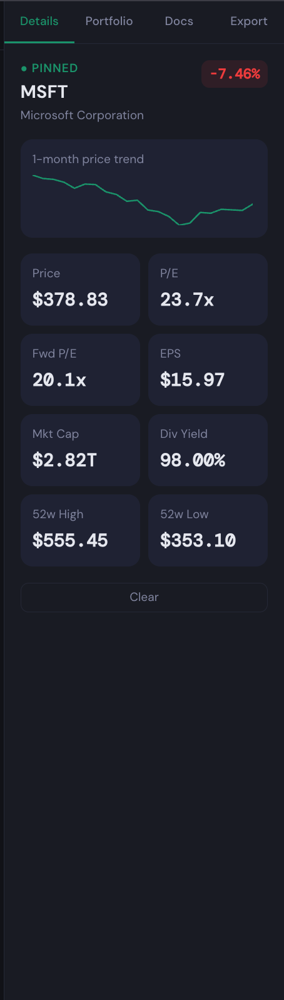
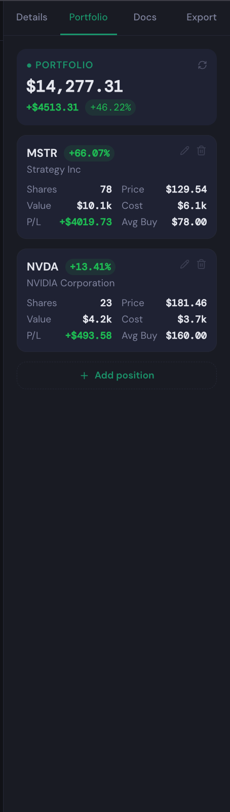
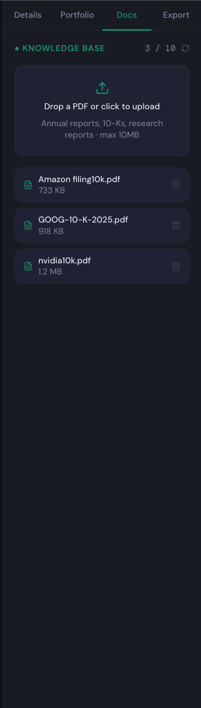

# finsight — AI Financial Research Assistant

An AI-powered financial chatbot built with a LangGraph ReAct agent, RAG pipeline for document Q&A, and a real-time streaming Next.js frontend.

---

## Screenshots

### Login


### Home — Live Market Ticker & Quick Prompts


### Market News with Sentiment Badges


### Stock Comparison Chart


### Document Q&A (RAG) — NVIDIA 10-K


### Stock Details Panel


### Portfolio Tracker


### Knowledge Base — Uploaded Documents


---

## Features

### Live Market Tools
- **Stock price & history** — real-time prices and interactive price charts via yfinance
- **Fundamentals** — P/E, EPS, market cap, dividend yield, 52-week range, moving averages
- **Stock comparison** — side-by-side normalised performance charts for multiple tickers
- **Portfolio risk** — Modern Portfolio Theory metrics: annualised return, volatility, Sharpe ratio, correlation matrix
- **News** — company-specific news (yfinance) and sector/macro news with sentiment badges (Alpha Vantage)

### Document Q&A (RAG)
- Upload financial PDFs (10-Ks, annual reports) to a personal knowledge base
- Chunks are embedded with OpenAI `text-embedding-ada-002` and stored in Supabase pgvector
- `MultiQueryRetriever` rephrases each query 3 ways to improve recall
- Source citations and similarity scores shown after every RAG response
- Per-document filtering so queries about Amazon don't pull NVIDIA chunks

### Interface
- Token-by-token streaming responses via Server-Sent Events (SSE)
- Scrolling live market ticker (S&P 500, Dow, NASDAQ, Gold, Bitcoin)
- Tabbed right panel: stock details, portfolio tracker, document manager, export
- Conversation export in PDF, CSV, and JSON
- Full conversation history persisted per user

### Auth & Security
- Supabase authentication (email/password + Google OAuth)
- Row Level Security — users can only access their own conversations and documents
- Per-user daily rate limiting (HTTP 429 when exceeded)
- API keys managed via environment variables, never hardcoded

---

## Architecture

```
frontend/          Next.js 16 / React 19
backend/
  main.py          FastAPI routes + SSE streaming
  agent/           LangGraph ReAct agent + conversation memory
  tools/           7 financial tool functions (@tool decorated)
  rag/             Ingestion, retriever, RAG chain
  db/              Supabase client, conversations, rate limiting
  config.py        Pydantic settings (env vars)
supabase/          SQL migrations (pgvector, RLS policies, RPCs)
```

**Request flow:**
```
User message → FastAPI /chat → LangGraph agent
  → picks tool(s) OR search_knowledge_base
  → executes, feeds result back to LLM
  → streams response tokens via SSE → frontend
```

---

## Tech Stack

| Layer | Technology |
|---|---|
| Backend | Python, FastAPI, LangChain, LangGraph |
| LLM | OpenAI GPT-4o |
| Embeddings | OpenAI text-embedding-ada-002 |
| Vector DB | Supabase pgvector (cosine similarity) |
| Market Data | yfinance, Alpha Vantage |
| Frontend | Next.js 16, React 19, Tailwind CSS, Chart.js |
| Auth & DB | Supabase (PostgreSQL + RLS) |
| Deployment | Railway (backend), Vercel (frontend) |

---

## Setup

### Prerequisites
- Python 3.11+
- Node.js 18+
- Supabase project with pgvector enabled
- OpenAI API key
- Alpha Vantage API key (free tier — for market/sector news)

### Backend

```bash
cd backend
python -m venv .venv
source .venv/bin/activate
pip install -r requirements.txt
```

Create `backend/.env`:
```env
OPENAI_API_KEY=sk-...
SUPABASE_URL=https://your-project.supabase.co
SUPABASE_KEY=your-anon-key
ALPHA_VANTAGE_API_KEY=your-key
DAILY_REQUEST_LIMIT=50
```

```bash
uvicorn main:app --reload
```

### Frontend

```bash
cd frontend
npm install
```

Create `frontend/.env.local`:
```env
NEXT_PUBLIC_SUPABASE_URL=https://your-project.supabase.co
NEXT_PUBLIC_SUPABASE_ANON_KEY=your-anon-key
NEXT_PUBLIC_API_URL=http://localhost:8000
```

```bash
npm run dev
```

### Database

Run the SQL migrations in `supabase/` against your Supabase project to create:
- `documents` table with pgvector column
- `conversations` table
- `api_usage` table for rate limiting
- `match_documents` and `increment_api_usage` RPC functions
- Row Level Security policies

---

## Key Design Decisions

**Why LangGraph instead of a simple LangChain chain?**
LangGraph's ReAct loop allows the agent to call multiple tools in sequence within a single user message — e.g. fetch a price, then fetch news, then synthesise both — with full conversation memory between turns.

**Why a custom Supabase retriever instead of LangChain's built-in?**
LangChain's `SupabaseVectorStore` is incompatible with `supabase-py` v2. The custom `SupabaseRetriever` calls the `match_documents` RPC directly and preserves similarity scores for display in the UI.

**Why `MultiQueryRetriever`?**
A single embedding query often misses relevant chunks if the phrasing doesn't closely match the document text. Generating 3 rephrased variants and taking the union significantly improves recall on financial documents.

**Why SSE instead of WebSockets?**
SSE is unidirectional (server → client), simpler to implement, and sufficient for streaming LLM tokens. No need for the overhead of a full WebSocket connection.

---

## Limitations

- Token count display is approximate — captures the last LangGraph step's usage rather than accumulating across all agent steps
- Alpha Vantage free tier: 25 req/min / 500 req/day hard cap
- Deleting a PDF does not remove its embeddings from pgvector (orphaned chunks)
- Portfolio endpoint fetches live prices on every request (no caching)

---

## Tests

```bash
cd backend
.venv/bin/python -m pytest
```
